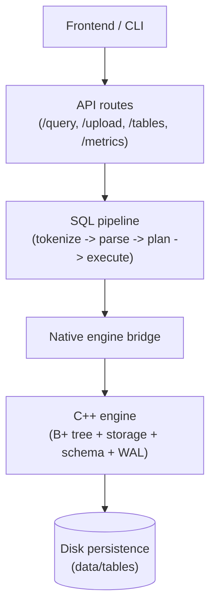
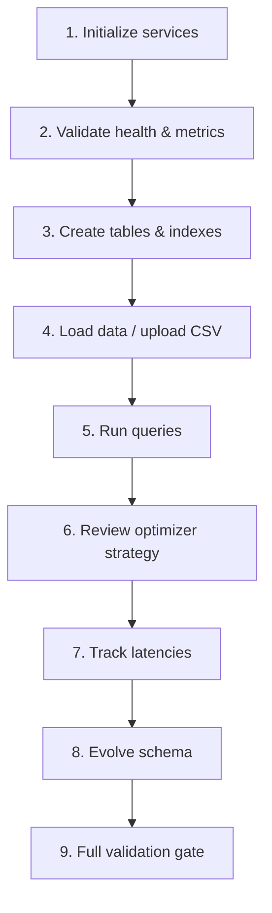
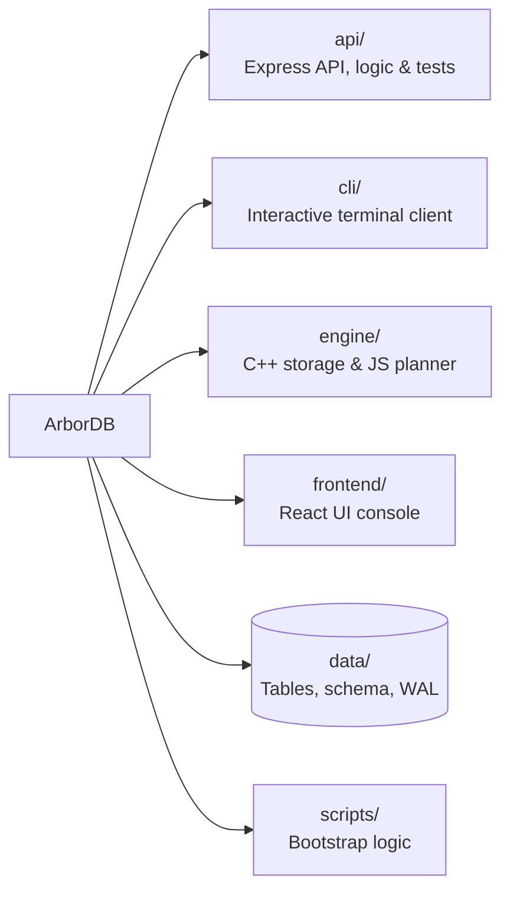

# ArborDB

ArborDB is a native-first local database system with a C++ storage engine, a Node.js API, a React frontend, and a CLI.
The project emphasizes predictable query behavior, index-aware execution, and testable observability.

## What Is Implemented

- SQL lifecycle: `CREATE TABLE`, `DROP TABLE`, `CREATE INDEX`, `CREATE UNIQUE INDEX`, `DROP INDEX`
- DML: `INSERT`, `SELECT`, `UPDATE`, `DELETE`
- Query features: `INNER JOIN`, aggregates (`COUNT`, `SUM`, `AVG`, `MIN`, `MAX`), `GROUP BY`, `HAVING`, `ORDER BY`, `LIMIT`, `OFFSET`
- Index-aware planning: primary-key lookup, secondary-index lookup, full-scan filter fallback
- Uploads: CSV/XLSX ingestion through `POST /upload`
- Observability: per-query metrics, recent query feed, aggregate engine/API metrics
- Persistence: native table/schema/WAL artifacts on disk

## Demo Video - [Click here]()

## Architecture



## Setup Instructions

### Prerequisites

- Node.js 18+
- npm 9+
- g++ with C++17 support

### 1. Build and Install Dependencies

```bash
./scripts/bootstrap.sh setup
```

### 2. Run Local Services

Terminal 1 (API):

```bash
./scripts/bootstrap.sh api
```

Terminal 2 (Frontend React App):

```bash
./scripts/bootstrap.sh frontend
```

Terminal 3 (optional CLI):

```bash
./scripts/bootstrap.sh cli
```

### Example `.env` Variables

```bash
ENGINE_PATH=../engine/build/engine
DATA_DIR=../data
```

*Note: The API uses a persistent native worker by default

## User Flow



1. Initialize services.
2. Validate health (`GET /health`) and confirm engine type via `GET /metrics`.
3. Create schema objects (`CREATE TABLE`, then optional `CREATE INDEX` for hot predicates).
4. Load data through `INSERT` statements or `POST /upload` (CSV/XLSX).
5. Run operational queries from frontend SQL console or CLI.
6. Use optimizer feedback (`response.optimization.strategy`) to verify index usage.
7. Track latency/traversal behavior in `response.metrics` and aggregate counters from `GET /metrics`.
8. Evolve schema safely: add/drop indexes and re-check strategy + metrics.
9. Before release, execute the full validation gate (`./scripts/bootstrap.sh check`).

## Query Examples

```sql
CREATE TABLE users (id INT PRIMARY KEY, name STRING, email STRING, age INT);
CREATE INDEX idx_users_email ON users (email);

INSERT INTO users VALUES (1, 'Alice', 'alice@arbordb.local', 30);
INSERT INTO users VALUES (2, 'Bob', 'bob@arbordb.local', 27);

SELECT * FROM users WHERE id = 1;
SELECT * FROM users WHERE email = 'alice@arbordb.local';
SELECT * FROM users WHERE age BETWEEN 25 AND 40;

SELECT u.id, o.amount
FROM users u
JOIN orders o ON u.id = o.user_id
ORDER BY o.amount DESC
LIMIT 10 OFFSET 0;

SELECT user_id, COUNT(*) AS orders_count, SUM(amount) AS total_amount
FROM orders
GROUP BY user_id
HAVING orders_count = 2
ORDER BY total_amount DESC;
```

## Index vs Non-Index Metrics

Measured on 2026-04-05 using the full evaluation profile:

```bash
cd api
npm run benchmark:eval
```

Comparison workload (steady-state):

- Dataset: `bench_users` with 1500 rows
- Indexed path: `secondary_index_lookup` workload (`WHERE email = ...`)
- Non-index path: `non_index_scan_filter` workload (`WHERE score BETWEEN ...`)

Results:

| Mode | Strategy | Query p50 (ms) | Query p95 (ms) | Client p50 (ms) | Client p95 (ms) | Nodes Traversed p50 |
| --- | --- | ---: | ---: | ---: | ---: | ---: |
| Non-indexed | `full_scan_filter` | 10 | 11 | 15.73 | 17.91 | 503 |
| Indexed | `secondary_index_lookup` | 1 | 2 | 4.95 | 7.30 | 5 |

Observed improvement:

- Query p50 reduction: 90.00%
- Query p95 reduction: 81.82%
- Client p50 reduction: 68.53%
- Client p95 reduction: 59.24%
- Traversal reduction (p50): 99.01%

## Advanced Evaluation

Run advanced latency evaluation (cold-start vs steady-state percentiles):

```bash
cd api
npm run benchmark:eval
```

This benchmark runs with the persistent worker mode and reports, per workload:

- `cold_start` metrics after cycling the worker
- `steady_state` percentile metrics after warm-up iterations
- `cache_effect` percentage improvement from cold-start to steady-state

It emits percentile stats (`avg`, `p50`, `p95`, `p99`, `max`) for:

- `query_time_ms` (server-side statement duration)
- `client_round_trip_ms` (application-observed end-to-end latency)
- `engine_boundary_ms` (API->native call envelope)
- `engine_core_ms` (native execution core time)
- `nodes_traversed` and `disk_reads` (execution-path diagnostics)

Use `cache_effect` to quantify in-memory cache gains for hot query paths.

Latest full evaluation snapshot (2026-04-05):

- Runtime: 20.99 seconds
- Dataset: 1500 rows (`bench_users`)
- Engine mode: `persistent-worker`

| Workload | Strategy | Query p50 (ms) | Query p95 (ms) | Client p50 (ms) | Client p95 (ms) | Cache Query p50 Improve | Cache Client p50 Improve |
| --- | --- | ---: | ---: | ---: | ---: | ---: | ---: |
| `pk_point_lookup` | `primary_key_lookup` | 1 | 1 | 4.72 | 6.70 | 95.65% | 81.80% |
| `secondary_index_lookup` | `secondary_index_lookup` | 1 | 2 | 4.95 | 7.30 | 95.65% | 82.00% |
| `non_index_scan_filter` | `full_scan_filter` | 10 | 11 | 15.73 | 17.91 | 71.43% | 62.44% |
| `order_by_limit` | `advanced_select` | 20 | 25 | 23.87 | 31.66 | 67.74% | 66.65% |

## Query Error Taxonomy

`POST /query` now emits stage-specific, stable error codes. Here is the query lifecycle:

| Stage | HTTP | Error Code | Meaning |
| --- | ---: | --- | --- |
| Request validation | 400 | `QUERY_VALIDATION_ERROR` | Invalid/missing SQL payload |
| Tokenization | 400 | `QUERY_TOKENIZE_ERROR` | Lexical failure (illegal token/character) |
| Parsing | 400 | `QUERY_PARSE_ERROR` | SQL grammar/syntax failure |
| Planning | 422 | `QUERY_PLAN_ERROR` | Query cannot be translated into executable command |
| Execution (query layer) | 500 | `QUERY_EXECUTION_ERROR` | Advanced execution path failed before engine completes |
| Native engine operation | 502 | `ENGINE_OPERATION_FAILED` | Engine returned an operation-level error |
| Native binary lookup | 500 | `ENGINE_NOT_FOUND` | Engine binary path invalid/missing |
| Native timeout | 504 | `ENGINE_TIMEOUT` | Engine call exceeded timeout |
| Native protocol/JSON | 502 | `ENGINE_PARSE_ERROR` | Engine response could not be parsed |

All error responses follow:

```json
{
  "error": {
    "code": "...",
    "message": "...",
    "timestamp": "ISO-8601",
    "details": {}
  }
}
```

## API Endpoints

- `POST /query` execute SQL
- `POST /upload` upload CSV/XLSX into an existing table
- `GET /tables` list tables and metadata
- `GET /tables/:name` get table details
- `GET /metrics` aggregate metrics and engine summary
- `GET /metrics/recent` recent query history
- `GET /health` health/status check

## Repository Layout



## License

MIT
